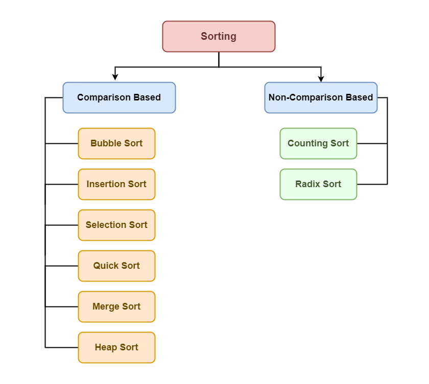

# Sorting

## Sorting Basics

- **In-place sorting:** An in-place sorting algorithm uses constant space for producing the output (modifies the given array only). Examples: Selection Sort, Bubble Sort, Insertion Sort, and Heap Sort.
- **External Sorting:** External sorting is when all the data that needs to be sorted need not be placed in memor at a time., the sorting is called external sorting. External sorting is used for a massive amount of data. For example, merge sort can be used in external sorting as the whole array does not have to be present all the time in memory.
- **Stable Sorting:** When two same items appear in the same order in sorted data as in the original array called stable sort. Examples: Merge sort, Insertion Sort, Bubble Sort.
- **Hybrid Sorting:** A sorting algorithm is called Hybrid if it uses more than one standard sorting algorithms to sort the array. The idea is to take advantages of multiple sorting algorithms. For example, `IntroSort` uses insertions sort and quick sort.

## Types of Sorting techniques

There are various sorting algorithms are used in data structures. The following two types of sorting algorithms can be broadly classified:

1. Comparison based: We compare the elements in a comparison based sorting algorithm.
2. Non-comparison based: We do not compare the elements in a non-comparison based sorting algorithm.
   

## Basic sorting algorithms:

1. **Bubble Sort**

It is a simple sorting algorithm that repeatedly swaps adjacent elements if they are in the wrong order. It performs multiple passes through the array and in each pass, the largest unsorted element moves to its correct position at the end.

After each pass, we ignore the last sorted elements and continue comparing and swapping remaining adjacent pairs. After k passes, the last k elements are sorted.

```python
def bubble_sort(arr: list[int]) -> list[int]:
    n = len(arr)

    for i in range(n):
        swapped = False
        for j in range(n - i - 1):
            if arr[j] > arr[j + 1]:
                arr[j], arr[j + 1] = arr[j + 1], arr[j]
                swapped = True

        if not swapped:
            """If no swap has happend in the current iteration, the array has been sorted completely. No need to continue"""
            break

    return arr

```

> Time complecity: O(n^2)

> Space complexity: O(1)

2. **Insertion Sort**

It is a simple sorting algorithm that builds the sorted array one element at a time. It works like sorting playing cards in your hand, where each new card is inserted into its correct position among the already sorted cards.

We start with the second element, assuming the first is already sorted. If the second element is smaller, we shift the first element and insert the second in the correct position. Then we move to the third element and place it correctly among the first two. This process continues until the entire array is sorted.

```python
def insertion_sort(arr):
    for i in range(1, len(arr)):
        key = arr[i]
        j = i - 1

        # Move elements of arr[0..i-1], that are
        # greater than key, to one position ahead
        # of their current position
        while j >= 0 and key < arr[j]:
            arr[j + 1] = arr[j]
            j -= 1
        arr[j + 1] = key

    return arr
```

> Time complexity: O(n^2)

> Space complexity: O(1)

3. **Selection Sort**

It is a simple sorting algorithm that repeatedly selects the smallest (or largets) element from the unsorted part of the array and swaps it with the first unsorted element. This process continues until the array is fully sorted.

```python
def selection_sort(arr: list[int]) -> list[int]:
    n = len(arr)

    for i in range(0, n-1):
        min_idx = i
        for j in range(i + 1, n):
            if arr[j] < arr[min_idx]:
                min_idx = j

        arr[i], arr[min_idx] = arr[min_idx], arr[i]

    return arr
```

> Time Complexity: O(n^2)

> Space Complexity: O(1)

4. **Counting Sort**

It is a non-comparison-based sorting algorithm that works efficiently when the range of input values is small relative to the number of elements. It counts the frequency of each distinct element and uses that count to place elements directly into their correct sorted positions.

However, if the maximum value is much larger than the array size (especially more than n log n), then standard comparison-based algorithms are usually more efficient.

```python
def counting_sort(arr: list[int]) -> list[int]:
    n = len(arr)

    # find the maximum element
    maxval = max(arr)

    # create and initialize count array
    count = [0] * (maxval + 1)

    # count frequency of each element
    for num in arr:
        count[num] += 1

    # compute prefix sum
    # This will actually tell us at what index will the particular value end.
    for i in range(1, maxval + 1):
        count[i] += count[i - 1]
        # count[i] becomes the last index on which this value will be present in the sorted array

    # build output array
    ans = [0] * n
    for i in range(n - 1, -1, -1):
        val = arr[i]
        ans[count[val] - 1] = val
        count[val] -= 1

    return ans
```

> Time Complexity: O(n + k) k is the length of the count array

> Space Complexity: O(n + k)
